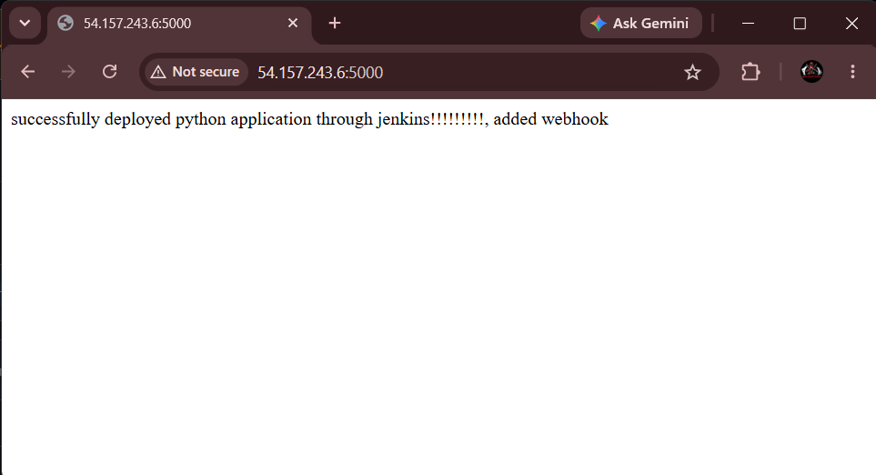
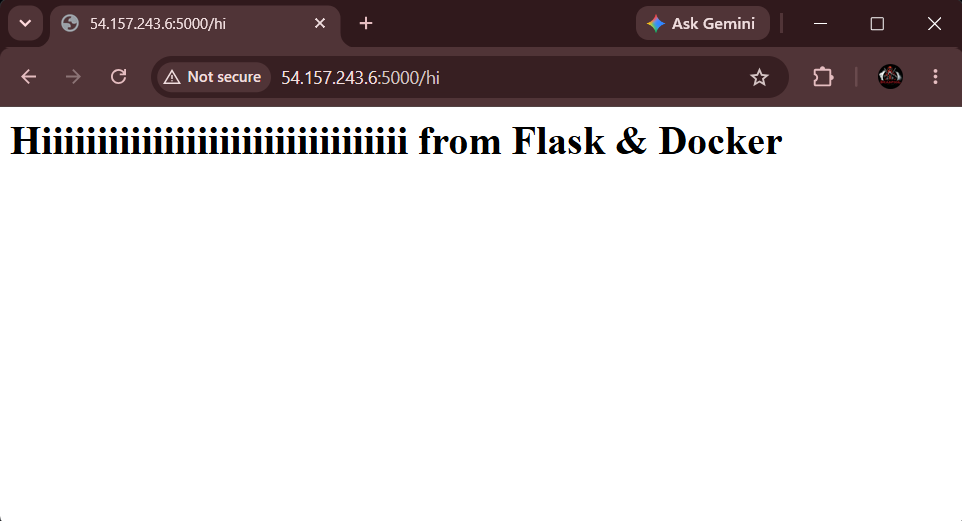

# 🐍 PythonProject

A simple Python **Flask** web application, built to demonstrate deploying a lightweight web app on an **AWS EC2** instance.

## 📖 Overview

This project is a minimal Flask app with two routes (`/` and `/hi`) that returns a plain-text/HTML response. It's designed as a hands-on exercise for provisioning a cloud server, configuring it, and running a Python web app on it using AWS.

## 🛠️ Tech Stack

- 🐍 **Language:** Python 3
- 🌶️ **Framework:** Flask
- 🚀 **WSGI Server:** Gunicorn
- ☁️ **Cloud Provider:** AWS (EC2)
- ✅ **Testing:** unittest

## 📂 Project Structure

```
PythonProject/
├── app.py              # Main Flask application
├── requirements.txt    # Python dependencies
├── test/
│   └── test.py         # Unit tests
└── README.md
```

## ✅ Prerequisites

- An AWS account with permissions to launch EC2 instances
- A key pair (`.pem` file) for SSH access
- Basic familiarity with the AWS Management Console and SSH

## ☁️ Deployment on AWS EC2

### 1️⃣ Launch an EC2 Instance

1. Log in to the [AWS Management Console](https://console.aws.amazon.com/).
2. Go to **EC2 → Launch Instance**.
3. Choose an Amazon Machine Image (AMI) — e.g., Amazon Linux 2 or Ubuntu.
4. Select an instance type (e.g., `t2.micro` — free tier eligible).
5. Select or create a key pair for SSH access.
6. Under **Network Settings**, create/select a security group and allow:
   - 🔐 **SSH (port 22)** — from your IP
   - 🌐 **Custom TCP (port 5000)** — from anywhere (`0.0.0.0/0`), for the Flask app
7. Launch the instance and wait until its status is **running**.

### 2️⃣ Connect to the Instance

```bash
ssh -i "your-key.pem" ec2-user@<ec2-public-ip>
```

### 3️⃣ Install Dependencies on the Server

```bash
python3 --version
sudo yum install python3-pip -y        # Amazon Linux
sudo yum install git -y

git config --global user.name "your-username"
git config --global user.email "your-email@example.com"
```

### 4️⃣ Clone the Repository

```bash
mkdir myflaskapp
cd myflaskapp/
python3 -m venv venv
source venv/bin/activate

git clone https://github.com/vinit-22/PythonProject.git
cd PythonProject
```

### 5️⃣ Install Python Requirements

```bash
pip install -r requirements.txt
```

### 6️⃣ Run the Application

```bash
python3 app.py
```

By default, the app runs on port `5000`. Make sure that port is open in your EC2 security group (see Step 1).

### 7️⃣ Access the App

Open a browser and go to:

```
http://<ec2-public-ip>:5000
```

You should see the app's response from the `/` route. Visiting `/hi` will show an additional HTML greeting.

## 📤 Output

Once the app is running and you visit it in a browser, you should see the following responses:





## 🚧 Future Enhancements

- 🔧 **CI/CD with Jenkins** — automate cloning, building, and deploying the app to the EC2 instance whenever changes are pushed, using a Jenkins pipeline (`Jenkinsfile`).
- 🐳 **Containerization with Docker** — package the app using the provided `Dockerfile` and run it as a container instead of directly on the host, for easier portability and environment consistency.
- ⚙️ Use a process manager (e.g., `systemd` or `supervisor`) or Gunicorn behind Nginx for production-grade serving instead of Flask's built-in dev server.
- 📈 Add an AWS Elastic Load Balancer and Auto Scaling Group for high availability.
- 🔑 Store configuration/secrets in AWS Systems Manager Parameter Store or Secrets Manager.

## 📄 License

This project is provided as-is for learning and demonstration purposes.

## ✍️ Author

**Vinit Mistry**
